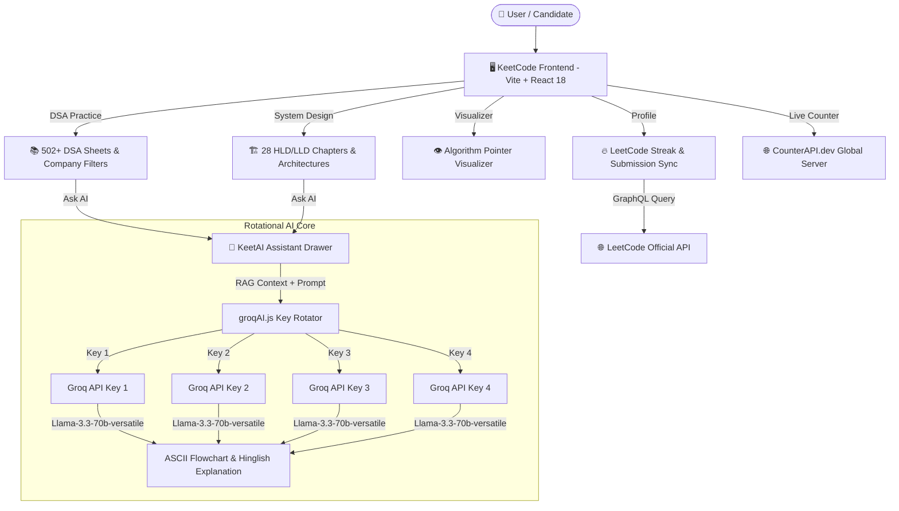

# 🚀 KeetCode - Master DSA & System Design Preparation Platform

<div align="center">

  
  
  
  
  

  <br />

  **The #1 All-in-One Ecosystem for Tier-1 Tech Interview Preparation.**
  <br />
  *502+ Curated DSA Questions • 28 System Design Chapters (HLD & LLD) • Interactive Pointer Visualizers • 4-Key Rotating Groq AI Tutor • LeetCode Streak Sync • Unified Excalidraw Scratchpad*

</div>

---

## 💡 Why Vikash Kumar Built KeetCode

> *"During my software engineering journey, I realized that blindly grinding 500+ random LeetCode questions without visual intuition or system design depth leads to burnout. Most existing platforms either offer plain text solutions without step-by-step visualizations, or charge heavy subscriptions for System Design notes.*
> 
> *I built **KeetCode** as a unified, open-access powerhouse where any aspiring engineer can learn Data Structures, master High-Level & Low-Level System Design, visualize algorithm pointer movements in real-time, draw on an integrated Excalidraw scratchpad, and chat with an AI tutor that explains complex concepts in Hinglish with ASCII flowcharts."* 
> 
> — **Vikash Kumar (Creator of KeetCode)**

---

## 🔥 Key Features & Capabilities

### 1. ⚡ 502+ Master DSA Practice Sheets
- **Structured Categories**: Arrays, Two Pointers, Sliding Window, Binary Search, Stacks & Queues, Trees, Graphs, Dynamic Programming.
- **Company-Wise Target Sheets**: Filter questions specifically asked in interviews at **Google, Meta, Amazon, Microsoft, Netflix, Apple, Uber, and Airbnb**.
- **Interactive Solutions**: Detailed intuition, C++ brute/optimal solutions, time/space complexity breakdowns, and sub-accordions.

### 2. 🏗️ 28 In-Depth System Design Notes (HLD & LLD)
- **High-Level Design (HLD)**: Distributed Rate Limiters, Kafka Event Queues, Ad Click Event Aggregators, Distributed Cache (LRU/LFU), Payment Gateways, Notification Systems.
- **Low-Level Design (LLD)**: Parking Lot, Elevator System, Snake & Ladder, Movie Ticket Booking System (BookMyShow).
- **Interactive Diagrams**: Architecture flowcharts, sequence diagrams, and scalability trade-offs.

### 3. 🤖 KeetAI Tutor (4-Groq API Key Rotation Engine)
- **Zero Rate Limits**: Automatic round-robin key rotation across 4 Groq API keys (`llama-3.3-70b-versatile`). If one key hits quota, it switches instantly with 0 downtime.
- **RAG Page Awareness**: Ingests active problem statements, C++ code, or System Design notes automatically.
- **Bilingual Interaction**: Responds in natural **Hinglish** or **English**.
- **ASCII Flowchart Generator**: Renders visual step-by-step ASCII logic flowcharts and Markdown complexity tables.
- **Multi-Turn Memory & `+ New Chat`**: Preserves chat context with 1-click memory reset.

### 4. 🎨 Unified Excalidraw Canvas & Scratchpad
- **Integrated Drawing Board**: Pen draw tool, rectangle node tool for array/tree elements, and C++ code snippet insertion right inside problem view.
- **Size Controls & Sticky Footer**: Expand/minimize note boxes with a sticky bottom save footer bar.

### 5. 🔥 Real-Time LeetCode Streak & Heatmap Sync
- **GraphQL Integration**: Syncs directly with official LeetCode user profiles.
- **Streak Tracker & Heatmap**: Auto-tracks active coding streaks, total solved problems, and submission heatmaps.

### 6. 👁️ Step-by-Step Algorithm Pointer Visualizer
- **Real-Time Pointer Movement**: Watch two-pointer and sliding window indices move in real-time.
- **Execution Terminal**: Live log terminal output with adjustable speed controls (Fast/Pause/Reset) and custom array/target input testing.

### 7. 🌐 100% Real Live Visitor Counter
- Powered by `counterapi.dev` for 100% genuine, authentic visitor tracking across global users starting from real counts.

---

## 🏗️ System Architecture & Data Flow



### AI Key Rotation & Fallback Flowchart

```
┌─────────────────────────────────────────────────────────────┐
│                 User Prompt + Page Context                  │
└──────────────────────────────┬──────────────────────────────┘
                               │
                               ▼
               ┌───────────────────────────────┐
               │    Groq Key Rotator Engine    │
               └───────────────┬───────────────┘
                               │
       ┌───────────────────────┼───────────────────────┐
       ▼                       ▼                       ▼
┌──────────────┐       ┌──────────────┐       ┌──────────────┐
│ Groq Key #1  │       │ Groq Key #2  │       │ Groq Key #3  │
└──────┬───────┘       └──────┬───────┘       └──────┬───────┘
       │ 429 Rate Limit       │ 429 Rate Limit       │ Success
       └──────► Switch ───────┴──────► Switch ───────┴──────► [ Llama-70B Response ]
```

---

## 💻 Tech Stack

| Component | Technology / Library |
| :--- | :--- |
| **Frontend Framework** | React 18, Vite |
| **Styling** | Custom Vanilla CSS (Glassmorphism design system) |
| **Icons** | Lucide React |
| **AI LLM Model** | Groq Llama-3.3-70B-Versatile (4-Key Round Robin) |
| **Authentication & Sync** | Firebase Web Auth (Google OAuth 2.0) |
| **External APIs** | LeetCode GraphQL API, CounterAPI.dev |

---

## 📂 Folder Structure

```
keetcode/
├── public/
│   └── favicon.svg               # Glowing custom KeetCode logo emblem
├── src/
│   ├── components/               # React UI Components
│   │   ├── AIChatDrawer.jsx      # Multi-turn KeetAI Tutor Drawer
│   │   ├── Auth.jsx              # Google Login Auth Card
│   │   ├── CompanySheet.jsx      # Company-wise DSA Problem Sheet
│   │   ├── Courses.jsx           # System Design & C++ Notes Reader
│   │   ├── Footer.jsx            # Global Footer & Live Visitor Counter
│   │   ├── Home.jsx              # Hero section, compiler demo, FAQs
│   │   ├── Problems.jsx          # Master 502+ DSA Sheets & Scratchpad
│   │   ├── Profile.jsx           # LeetCode Sync Heatmap & Stats
│   │   └── VisualizerPage.jsx    # Interactive Algorithm Pointer Visualizer
│   ├── data/                     # Problem Sets & System Design Chapters
│   │   ├── companyProblemsData.js
│   │   ├── cppNotesData.js
│   │   ├── dsaProblemsData.js
│   │   └── systemDesignNotesData.js
│   ├── utils/                    # Core Business Logic & Helpers
│   │   ├── firebase.js           # Firebase Auth Config
│   │   ├── groqAI.js             # 4-Key Groq AI Key Rotation Engine
│   │   ├── progressSync.js       # LeetCode Progress & Heatmap Sync
│   │   └── visitorTracker.js     # Real Live Visitor Counter
│   ├── App.jsx                   # Main Router & Top Navbar
│   ├── index.css                 # Global Design Tokens & Glassmorphism
│   └── main.jsx                  # Entry Point
├── index.html                    # SEO Metadata & JSON-LD Schema
├── package.json
└── vite.config.js
```

---

## 🚀 Local Setup & Installation

### Prerequisites
- Node.js (v18.0.0 or higher)
- npm or yarn

### Steps

1. **Clone the Repository**
   ```bash
   git clone https://github.com/vikashkumar302004/keetcode.git
   cd keetcode
   ```

2. **Install Dependencies**
   ```bash
   npm install
   ```

3. **Configure Environment Variables**
   Create a `.env` file in the root directory:
   ```env
   VITE_GROQ_KEYS=key1,key2,key3,key4
   ```

4. **Run Development Server**
   ```bash
   npm run dev
   ```
   Open `http://localhost:3000` in your browser.

5. **Build for Production**
   ```bash
   npm run build
   ```

---

## 📜 License

This project is licensed under the **MIT License** - see the [LICENSE](LICENSE) file for details.

```
MIT License

Copyright (c) 2026 Vikash Kumar

Permission is hereby granted, free of charge, to any person obtaining a copy
of this software and associated documentation files (the "Software"), to deal
in the Software without restriction, including without limitation the rights
to use, copy, modify, merge, publish, distribute, sublicense, and/or sell
copies of the Software, and to permit persons to whom the Software is
furnished to do so, subject to the following conditions:

The above copyright notice and this permission notice shall be included in all
copies or substantial portions of the Software.

THE SOFTWARE IS PROVIDED "AS IS", WITHOUT WARRANTY OF ANY KIND, EXPRESS OR
IMPLIED, INCLUDING BUT NOT LIMITED TO THE WARRANTIES OF MERCHANTABILITY,
FITNESS FOR A PARTICULAR PURPOSE AND NONINFRINGEMENT. IN NO EVENT SHALL THE
AUTHORS OR COPYRIGHT HOLDERS BE LIABLE FOR ANY CLAIM, DAMAGES OR OTHER
LIABILITY, WHETHER IN AN ACTION OF CONTRACT, TORT OR OTHERWISE, ARISING FROM,
OUT OF OR IN CONNECTION WITH THE SOFTWARE OR THE USE OR OTHER DEALINGS IN THE
SOFTWARE.
```

---

<div align="center">
  Crafted with ❤️ by <strong>Vikash Kumar</strong> • Happy Coding & System Designing! 🚀
</div>
