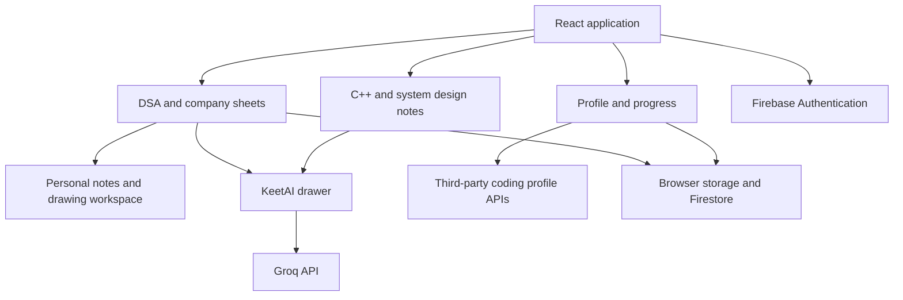

# KeetCode — My DSA & System Design Practice Platform


I'm **Vikash Kumar**, and I built KeetCode to bring DSA practice, C++ notes, system design, and progress tracking into one place. My goal is to make interview preparation more structured, with room to understand an approach, write down the reasoning, and revisit problems later.

[Live app](https://keetcode.vercel.app/) · [My GitHub](https://github.com/vikashkumar302004) · [Report an issue](https://github.com/vikashkumar302004/keetcode/issues)

## Why I built it

I wanted more than a list of questions to tick off. I wanted a workspace where I could move between a problem, its explanation, my own notes, and the bigger concepts behind it without constantly switching tools.

That idea became KeetCode. I brought together topic-based practice sheets, company-wise questions, system design material, a drawing scratchpad, and an AI tutor that can explain concepts in English or Hinglish.

## What I've included

### DSA practice and company sheets

I've organized problems around topics such as arrays, two pointers, sliding windows, binary search, trees, graphs, and dynamic programming. I also included company-wise sheets to help narrow down practice.

The problem views support completion tracking, revision bookmarks, and personal notes. Where editorials are available, I include the intuition, C++ approaches, and time and space complexity.

### C++ and system design notes

I've added C++ study material alongside high-level and low-level system design chapters. These cover topics such as rate limiting, caching, event queues, payment systems, parking lots, and elevators. I use diagrams and explanations to connect the components of a design with the trade-offs behind them.

### KeetAI tutor

I built KeetAI around Groq's `llama-3.3-70b-versatile` model. The chat includes the active page's context so I can ask questions about the problem or notes I'm reading.

I've included conversational history, a new-chat action, English and Hinglish explanations, and support for code blocks and ASCII diagrams. The helper can rotate through configured API keys and retry requests, although provider limits and outages can still affect responses.

### Notes and a drawing scratchpad

I've included text notes and a drawing workspace inside the problem workflow. I can record an approach, sketch pointer movements or data structures, and expand the notes editor when I need more space.

### Profiles and progress sync

I use Firebase Authentication for Google sign-in and Firestore for signed-in progress sync, with browser storage for local state.

I've also added LeetCode profile syncing for solved counts, submission activity, and streak information through a third-party API. A GeeksforGeeks profile integration is included as well. These integrations depend on the availability and responses of their external services.

### Algorithm visualization

I've included an interactive demonstration on the home page with custom array and target inputs. The dedicated per-problem visualizer page is still a coming-soon screen; I haven't finished that part yet.

### Accessibility improvements

I've added accessible names to search fields, filters, notes editors, and icon buttons. Revision toggles expose their state, profile labels are connected to their inputs, and the profile editor's close control supports keyboard interaction.

## How I've structured the app

I use React and Vite for the frontend, custom CSS for the interface, and Lucide React for icons. The main application connects the practice pages, learning material, profile, and AI drawer.


```mermaid
flowchart TD
    App[React application] --> Problems[DSA and company sheets]
    App --> Courses[C++ and system design notes]
    App --> Profile[Profile and progress]
    Problems --> Notes[Personal notes and drawing workspace]
    Problems --> Tutor[KeetAI drawer]
    Courses --> Tutor
    Tutor --> Groq[Groq API]
    Profile --> APIs[Third-party coding profile APIs]
    App --> Auth[Firebase Authentication]
    Problems --> Storage[Browser storage and Firestore]
    Profile --> Storage
```

I've kept the UI components, study data, and service helpers in separate folders:

```text
keetcode/
├── public/                      # Static assets
├── src/
│   ├── components/              # Practice, courses, profile, auth, and chat UI
│   ├── data/                    # Problem sets and study material
│   ├── utils/
│   │   ├── editorials/          # Topic-specific problem explanations
│   │   ├── analytics.js         # Analytics events and page views
│   │   ├── firebase.js          # Firebase initialization
│   │   ├── groqAI.js            # AI requests and key rotation
│   │   ├── progressSync.js      # Local, cloud, and coding-profile sync
│   │   └── visitorTracker.js    # Counter API helper
│   ├── App.jsx                 # Main navigation and application state
│   ├── index.css               # Shared styles
│   └── main.jsx                # Application entry point
├── index.html
├── package.json
└── vite.config.js
```

## How I run it locally

I use Node.js and npm for local development.

```bash
git clone https://github.com/vikashkumar302004/keetcode.git
cd keetcode
npm install
```

For local AI functionality, I configure a `.env` file in the project root:

```env
VITE_GROQ_KEYS=your_groq_api_key
```

The helper also accepts comma-separated keys. I keep `.env` out of Git. Since Vite includes `VITE_` values in browser bundles, this setup does not keep an API key secret from app users; a deployed app should route secret-bearing AI requests through a backend.

Firebase initialization lives in `src/utils/firebase.js`. For an independent deployment, use your own Firebase project, configure Google sign-in and its authorized domains, and set appropriate Firestore access rules.

I start the development server with:

```bash
npm run dev
```

The configured port is `3000`; I use the URL printed by Vite if that port is already occupied.

To build and preview the production output, I run:

```bash
npm run build
npm run preview
```

## Feedback and contributions

I'm happy to receive bug reports, corrections to explanations, and suggestions that make the learning experience better. Open an issue with the problem, the expected behavior, and steps to reproduce it. For a contribution, keep the change focused and explain what it improves.

## License

I've released KeetCode under the [MIT License](LICENSE).

Copyright © 2026 Vikash Kumar.
